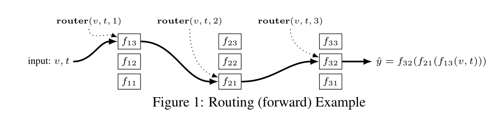
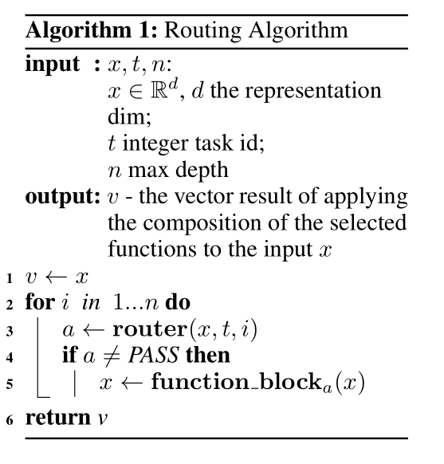

# 
路由网：多任务学习中非线性函数的自适应选择
  

## 摘要  
多任务学习经受任务干扰，提出了一种路由网络：由路由器和一些功能块组成。使用多代理强化学习（multi-agent reinforcement learning,MARL）来联合训练路由和功能块。实验结果表明精度有提升，且训练时间大大缩短，相较十字绣网络提升85%。  
## 1 引言  
路由网可以防止负迁移。路由器的决定可以由多种因素改变。由于路由器会做出一系列不可微的困难决策，因此采用强化学习来训练他们。功能块可以用任何一种网络层。  
## 2 相关工作  
在路由网络中学习的是一个完全动态的组合模型，它可以根据不同的任务调整其结构。与注意力机制和选门机制的MTL有着相同的目标，但是能用于多达20个任务的MTL。本文与混合专家模型也有相似之处，但是其并未扩展到大规模任务应用中去。此项工作扩展进了自动架构搜索这一新兴领域。最近持续学习引起了广泛关注。但是周期太长。任务特定路由作为一种认知功能的高层次思想是建立在人类大脑的生物学研究和理论基础上的。？？？这么牛逼有点吹了。  
## 3 路由网络  
路由是迭代地应用路由器来选择要组成的功能块并应用于输入向量的过程，处理过程如下：  

  

如果功能块具有不同的维度，则路由器必须选择维度匹配的功能块。具体的路由算法如下，其中，PASS表示跳过当前迭代，直接进入下一次迭代，因此，最终选择的功能块的个数可能小于路由深度。  

  
